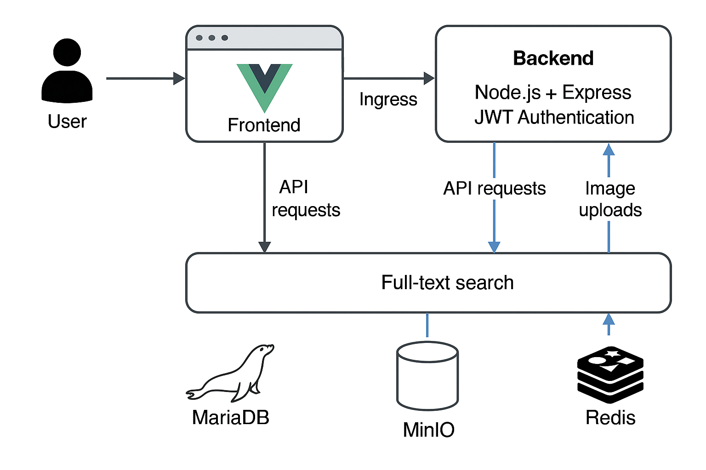

# THE HARP OF JSE Website

A simple web application to showcase poetry, organized into albums. Built with **Vue.js** for the frontend and **Node.js + Express** for the backend. Deployed on a **k3s cluster**.

## Features
- Album-based organization of poems
- Each lyric includes timestamp and image
- Full-text, case-insensitive search
- Admin area for content management
- JWT authentication for admin access

## Architecture Overview


### Components
- **Frontend:** Vue.js SPA
- **Backend:** Node.js + Express API
- **Database:** MariaDB for lyrics and collections
- **Storage:** MinIO for images
- **Cache:** Redis for search optimization
- **Security:** JWT authentication
- **Deployment:** k3s with Ingress

## Repository Structure
```
poetry-website/
├── frontend/        # Vue.js SPA
├── backend/         # Node.js + Express API
├── k8s/             # Kubernetes manifests
└── README.md
```

## Deployment
- Build Docker images for frontend and backend
- Apply Kubernetes manifests in `k8s/`
- Configure Ingress for routing
